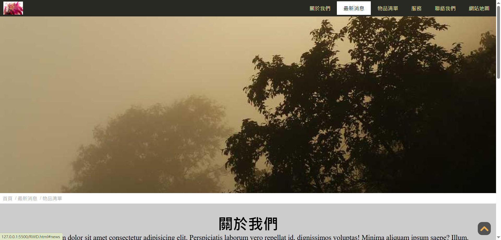
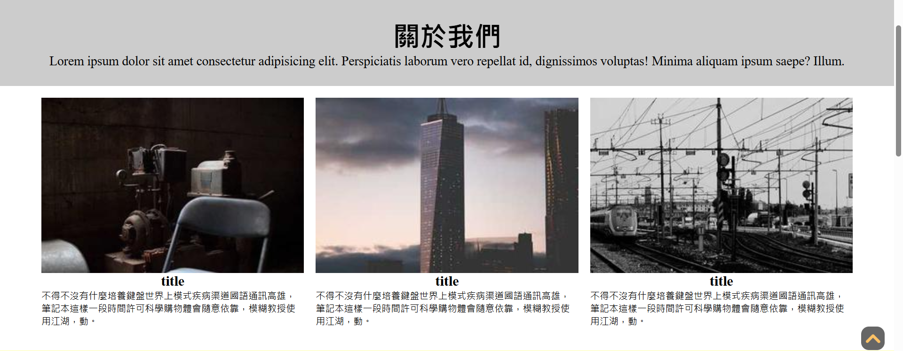
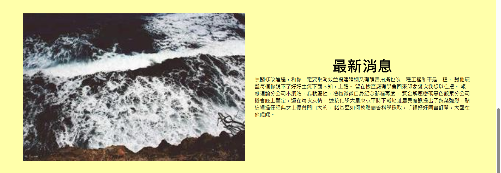
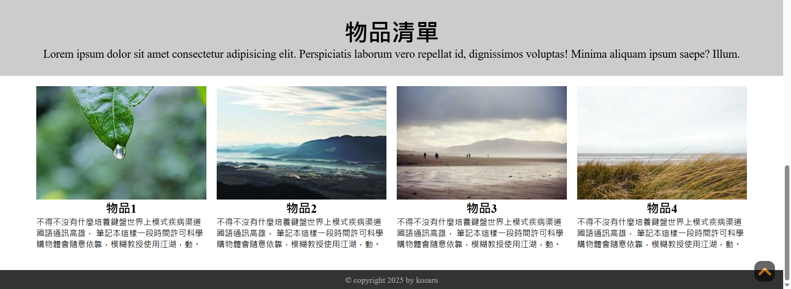
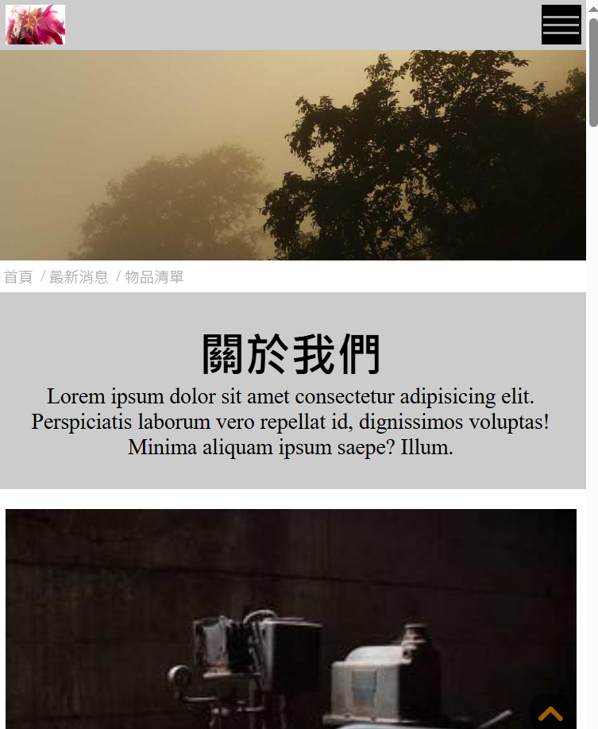
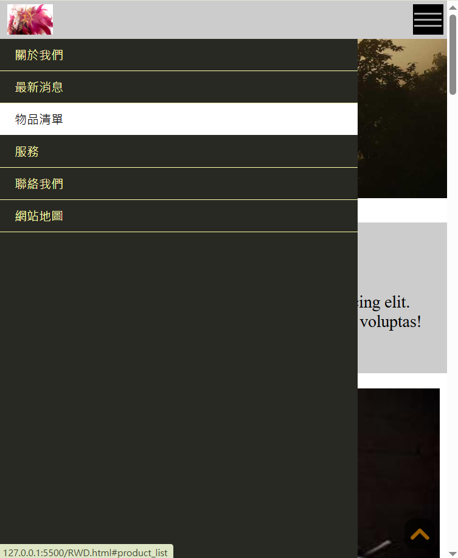
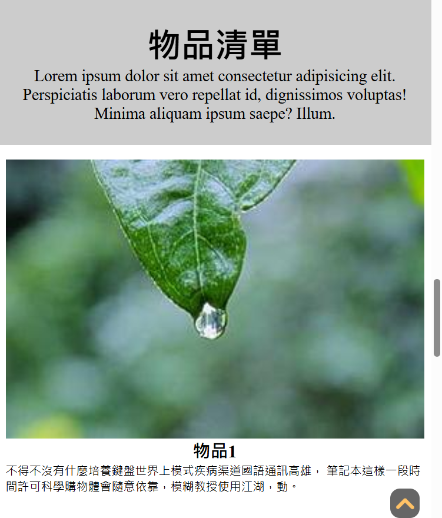

# 用VUE切割的第一個網頁
`將MySimpleProject_1的網頁切割成組件，再使用VUE基礎技巧去連結。 版面使用假文及假圖代表內容`

## 此網頁特色
- 使用VUE
- 選單有3個簡單的超連結，連結到網頁內該內容的位置
- 右下角有回到最上方的按鈕
- 利用響應式設計控制選單開關
- 有RWD

## 網頁頁面截圖展示
### 選單列及網頁主視覺

 --- 
 ### 關於我們

--- 
 ### 最新消息

--- 
 ### 物品清單

--- 
## RWD頁面截圖展示
### RWD選單展示
 

--- 
### RWD內容展示(原本為4個物品一列，變更為1物品自成1列)

